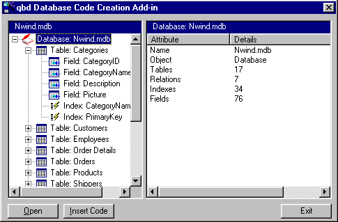



## Database Coder

### Description

Improved code production, index/relation handling and now supports Queries. Database Coder analyses an Access Database and produces the code to create a blank copy of it. Supports Tables, Fields, Indexes, Relations and Queries. Interested in comments.

Updated 26 May 2000: Improved handling of default field values and minor bug fix.
 
### More Info
 

             |
---                |---
**Submitted On**   |2000-05-26 17:10:10
**By**             |[Edward](https://github.com/Planet-Source-Code/PSCIndex/blob/master/ByAuthor/edward.md)
**Level**          |Intermediate
**User Rating**    |4.9 (39 globes from 8 users)
**Compatibility**  |VB 5\.0, VB 6\.0
**Category**       |[Databases/ Data Access/ DAO/ ADO](https://github.com/Planet-Source-Code/PSCIndex/blob/master/ByCategory/databases-data-access-dao-ado__1-6.md)
**World**          |[Visual Basic](https://github.com/Planet-Source-Code/PSCIndex/blob/master/ByWorld/visual-basic.md)
**Archive File**   |[CODE\_UPLOAD61245262000\.zip](https://github.com/Planet-Source-Code/edward-database-coder__1-8210/archive/master.zip)

